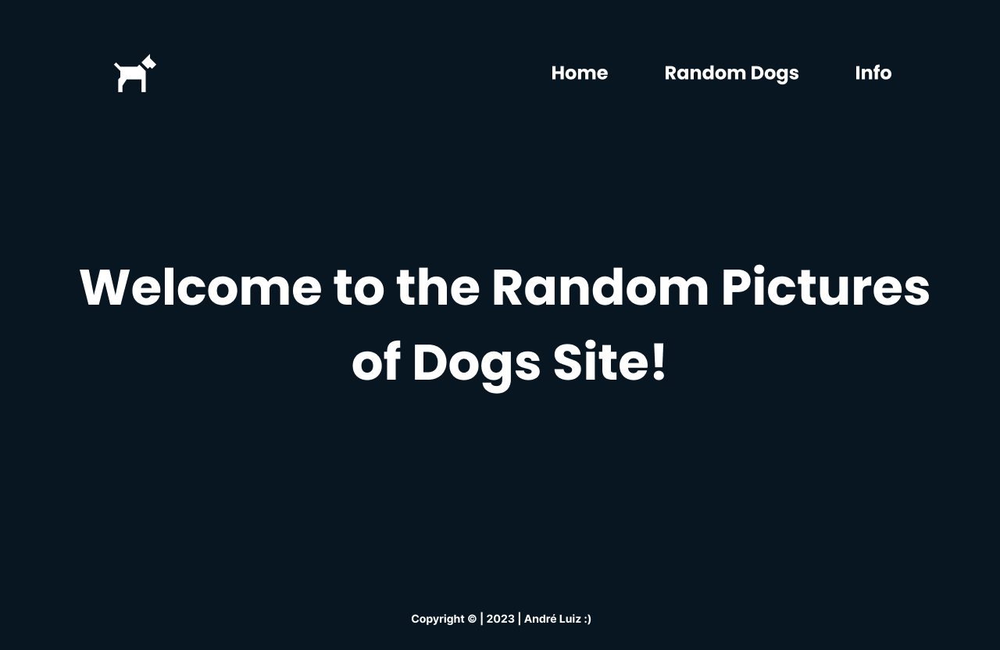

# Random-Dogs

## Sobre o Projeto

A atividade tem como objetivo didático, para o consumo de uma api pronta e gratuita, do curso de desenvolvimento de sistemas do SENAI Jandira. O projeto é tinha que utilizar Routes e Web Componentes.

- [Link do site](https://random-dogs-rho.vercel.app)
- [Link da api ](https://dog.ceo/dog-api/)

 

## Tecnologias utilizadas

- Javascript
- HTML
- CSS
- Figma
- Markdown

 

### Deploy Front-End

Realizado com o [Vercel](https://vercel.com/)

 

## Repositorios

### Confira também os repositorios:

[Front-End](https://github.com/AndreLuisConstantino/Random-Dogs) - Você está aqui 🚩

[Figma](https://www.figma.com/file/QlkMJFdeOtMDQ9DpGn3JQ5/The-Random-Dogs-Sites?type=design&node-id=0-1&t=WSc4cjrLygx5Hc2G-0)

 

## Colaboradores

|                                                                                                             |                                                                                                                                                              |
| ----------------------------------------------------------------------------------------------------------- | ------------------------------------------------------------------------------------------------------------------------------------------------------------ |
|  |   |

